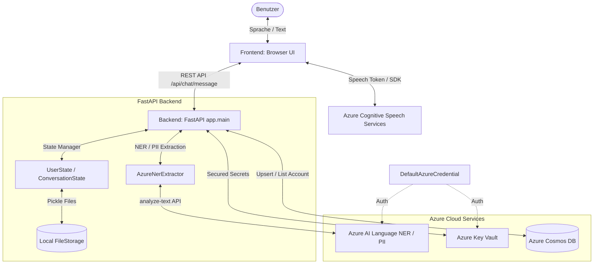
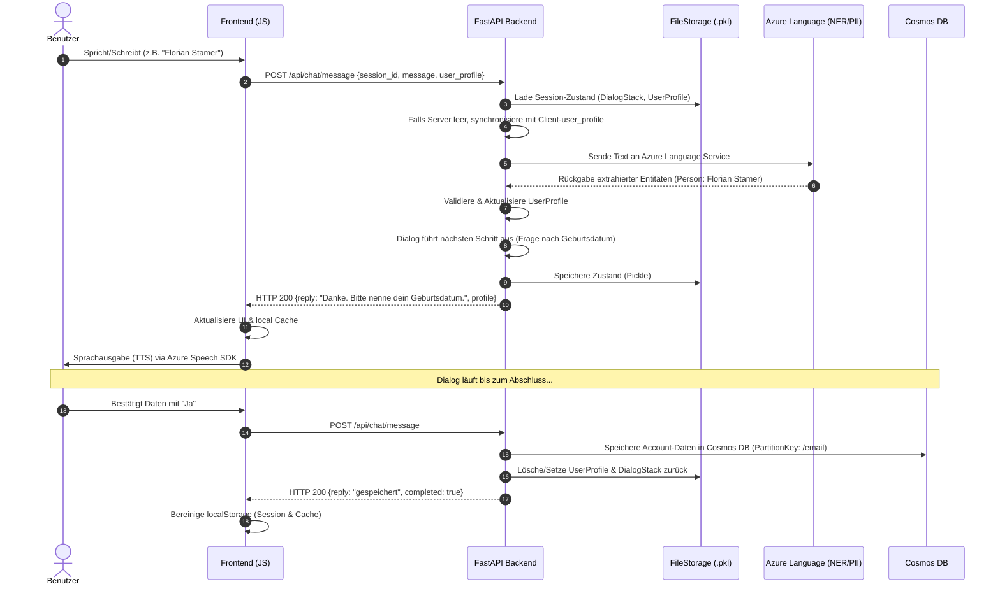

# Konzeptpapier: Entwicklung eines Sprachbots zur Benutzerregistrierung

**Veranstaltung:** Advanced Topics in Cloud Computing (Sommersemester 2026)  
**Dozent:** Prof. Dr.-Ing. Florian Marquardt  
**Eingereicht von:** [Florian Stamer]  
**Datum:** 04.05.2026

---

## 1. Zielsetzung und Projektübersicht
Im Rahmen dieses Projekts wird ein cloudbasierter Sprachbot entwickelt, der Nutzer durch einen natürlichsprachlichen Dialog führt, um systematisch alle erforderlichen Daten für die Erstellung eines Benutzeraccounts zu erfassen. Die Implementierung stützt sich auf moderne Microsoft Azure-Dienste, um eine robuste Sprachverarbeitung (Speech-to-Text, Text-to-Speech), Intent-Erkennung (CLU) und sichere Datenspeicherung zu gewährleisten.

---

## 2. Dialogfluss (Dialog Flow)
Der nachfolgende Ablauf beschreibt den idealen Pfad ("Happy Path") der Registrierung sowie die integrierte Fehlerbehandlung bei unklaren Eingaben oder unvollständigen Daten.

*Hinweis für die Umsetzung in draw.io: Dieser Text kann als lineares Flussdiagramm mit Rückkopplungsschleifen visualisiert werden.*

1. **Initialisierung & Begrüßung:**
    * **Bot:** "Willkommen! Ich helfe dir bei der Erstellung deines neuen Accounts. Lass uns mit deinen persönlichen Daten beginnen. Wie lauten dein Vor- und Nachname?"
2. **Erfassung Persönliche Daten:**
    * **Nutzer:** Nennt Namen.
    * *System-Aktion:* Extraktion von Vorname und Nachname via Azure CLU.
    * **Bot:** "Danke. Bitte nenne mir nun dein Geburtsdatum."
3. **Erfassung Adressdaten:**
    * **Bot:** "Wie lautet deine vollständige Adresse (Straße, Hausnummer, PLZ, Ort, Land)?"
    * **Nutzer:** Nennt Adresse.
    * *System-Aktion:* Validierung der Adress-Entitäten.
    * *Fehlerbehandlung (Fallback):* Fehlt z. B. die Postleitzahl, fragt der Bot gezielt nach: "Ich habe die Postleitzahl nicht verstanden. Kannst du diese bitte wiederholen?"
4. **Erfassung Kontaktdaten:**
    * **Bot:** "Fast geschafft. Unter welcher E-Mail-Adresse und Telefonnummer bist du erreichbar?"
    * **Nutzer:** Nennt Kontaktdaten.
5. **Validierung & Abschluss:**
    * **Bot:** "Vielen Dank. Ich fasse zusammen: Du heißt [Name], wohnst in [Ort] und deine E-Mail ist [E-Mail]. Sind diese Daten korrekt?"
    * **Nutzer:** "Ja." / "Nein" (Bei "Nein" Rücksprung zur entsprechenden Abfrage).
    * *System-Aktion:* Daten werden über den App Service an Cosmos DB übermittelt. Passwörter werden gemäß Anforderung nicht erfasst.
    * **Bot:** "Dein Account wurde erfolgreich angelegt. Auf Wiedersehen!"

---

## 3. Geplante Azure-Architektur
Die Systemarchitektur ist modular aufgebaut und trennt Dialogmanagement, Geschäftslogik und Datenzugriff strikt voneinander.

* **Benutzer-Schnittstelle (Channels):** Die Interaktion erfolgt primär über Voice Chat (Browser) oder Microsoft Teams.
* **Azure Bot Service:** Fungiert als zentraler Router für die verschiedenen Kommunikationskanäle und leitet die Nachrichten an die Applikation weiter.
* **Azure App Service (Node.js / Python):** Hostet das Bot Framework SDK und beinhaltet die Kern-Geschäftslogik, den Dialogfluss (Dialog Management) sowie die Validierungsroutinen.
* **Azure Cognitive Services:**
    * **Speech Services:** Wandelt die gesprochenen Antworten des Nutzers in Text um (Speech-to-Text) und generiert die Sprachausgabe des Bots (Text-to-Speech).
    * **Azure AI Language (CLU):** Analysiert den transkribierten Text, um Absichten (Intents, z. B. `RegistrierungStarten`) zu erkennen und Entitäten (Entities, z. B. `Vorname`, `Stadt`) zu extrahieren.
* **Azure SQL Database:** Dient der relationalen und sicheren Speicherung der validierten Nutzerdaten.
* **Azure Key Vault:** Speichert alle kritischen Geheimnisse, wie Datenbank-Verbindungszeichenfolgen und API-Schlüssel.

---

## 4. Quelltextverwaltung
Der Programmcode, die Dokumentation sowie die CI/CD-Pipelines werden in einem zentralen GitHub-Repository verwaltet.

**Link zum Repository:** [https://github.com/LordGuenni/cloud-bot](https://github.com/LordGuenni/cloud-bot)

---

## 5. Technische Blocker & Cloud Governance (Status: Language Model)
Im Rahmen von Meilenstein 1 wurden die grundlegenden Azure-Ressourcen (Ressourcengruppe, Sprachdienst, Speech Services) erfolgreich in der Region `germanywestcentral` bereitgestellt. Bei der Initialisierung des Conversational Language Understanding (CLU) Modells über die REST-API trat jedoch ein Architektur-Konflikt auf:

Die bereitgestellte Subscription ("Azure for Students") unterliegt in diesem Mandanten einer restriktiven Azure Policy, die das Deployment auf fünf spezifische Regionen limitiert (*spaincentral, uaenorth, polandcentral, germanywestcentral, italynorth*). Laut offizieller Dokumentation unterstützt Microsoft das **Authoring** (Erstellen/Editieren) von CLU-Projekten in diesen Regionen aktuell jedoch nicht (Fehlercode: `UnsupportedFeature`).

Ein Ausweichen auf voll unterstützte Regionen wie `westeurope` wird durch die Tenant-Policy blockiert. Die Vorbereitung der API-Aufrufe (JSON-Bodys für Intents und Entities) wurde dennoch abgeschlossen und dokumentiert. Um den Prototyp für Meilenstein 2 lauffähig zu machen, muss diese Policy-Restriktion im Tenant gelockert werden, oder es muss auf alternative Dienste ausgewichen werden.

---

## 6. Anhang: Nachweis der eingerichteten Azure-Ressourcen
1. **Screenshot 1:** Übersicht der Azure-Ressourcengruppe (ACLOUD) mit den aktiven Diensten.
2. **Screenshot 2:** Dokumentation der Terminal-Ausgabe (curl) zur Projekt-Initialisierung.
3. **Screenshot 3:** Beleg der Fehlermeldung (`UnsupportedFeature`) und Abgleich mit der Microsoft-Verfügbarkeitsmatrix für die Region `germanywestcentral`.

---

## 7. Framework zum Testen der Azure-Ressourcen

Im Repository liegt ein Python-Testskript, das die bereitgestellten Azure-Ressourcen automatisiert prüft:

- Datei: `azure_resource_test.py`
- Konfigurationsvorlage: `config.template.json`

### Einrichtung

1. Azure CLI Login durchführen:
   ```bash
   az login
   ```
2. Vorlage kopieren:
   ```bash
   cp config.template.json config.json
   ```
3. In `config.json` die Secret-Namen im Block `key_vault_secret_names` eintragen.

### Ausführung

```bash
python3 azure_resource_test.py --config config.json
```

Optional mit JSON-Report:

```bash
python3 azure_resource_test.py --config config.json --report-json report.json
```

---

## 8. NER-Test für Registrierungsdaten (Azure Language)

Mit `ner_service_test.py` kannst du einen Freitext gegen deinen Azure Language Service testen.  
Das Skript lädt `language-endpoint` und `language-key` aus Key Vault (über `config.json`) und extrahiert u. a.:

- Name (inkl. Vor-/Nachname-Heuristik)
- E-Mail
- Telefonnummer
- Adresse
- PLZ
- Stadt / Land
- Geburtsdatum
- Benutzername (Regex-Heuristik)

### Setup

```bash
pip install -r requirements.txt
az login
```

### Beispielaufruf

```bash
python3 ner_service_test.py --config config.json --text "Hallo, ich heiße Max Mustermann, mein Benutzername ist maxm, meine E-Mail ist max@example.com, Telefon +49 151 1234567, ich wohne in der Hauptstraße 12, 50667 Köln, Deutschland."
```

Mit Raw-Entity-Ausgabe:

```bash
python3 ner_service_test.py --config config.json --text "..." --raw
```

---

## 9. Start: Browser Chat + Voice Registration Bot (Prototype)

Dieses Prototype-Setup nutzt:
- **FastAPI Backend** für den Dialogfluss
- **Slot-Filling Registrierung** mit direkter **Azure NER/PII**-Extraktion (ohne Custom-Training)
- **Browser UI** mit Chat + Spracheingabe/-ausgabe über **Azure Speech Services**
- **Cosmos DB Speicherung** der bestätigten Accounts

### Installation

```bash
python3 -m venv .venv
source .venv/bin/activate
pip install -r requirements.txt
az login
```

### Starten

```bash
uvicorn app.main:app --reload
```

Danach im Browser öffnen:

```text
http://127.0.0.1:8000
```

### Erforderliche Key Vault Secrets

In `config.json` müssen diese Secret-Mappings gesetzt sein:

- `speech_key`, `speech_region`
- `language_endpoint`, `language_key`
- `cosmos_endpoint`, `cosmos_key`, `cosmos_database`, `cosmos_container`

### API-Endpunkte

- `POST /api/chat/start` – neue Session starten
- `POST /api/chat/message` – Nachricht senden
- `GET /api/admin/accounts` – erfasste Accounts anzeigen
- `GET /api/speech/token` – Azure Speech Token für Browser-Client

---

## 10. Technische Dokumentation

### Systemarchitektur (Architecture Diagram)

Die Systemarchitektur kombiniert ein schlankes, reaktionsschnelles Frontend (Vanilla HTML, CSS, JS) mit einem robusten FastAPI-Backend, das die Dialogführung über das Bot Framework SDK steuert. 



### Dialog- & Datenfluss (Sequence Diagram)

Der Ablauf zeigt, wie eine Nachricht vom Benutzer verarbeitet wird, wie Entitäten extrahiert/validiert werden und wie die Sitzung persistent gespeichert wird:



---

## 11. Azure-Umgebungs-Setup & Installationsanleitung

Diese Anleitung führt Schritt für Schritt durch die Einrichtung aller erforderlichen Microsoft Azure-Ressourcen und die lokale Anbindung über den `DefaultAzureCredential`.

### 1. Voraussetzungen
- Ein aktives Azure-Konto (z. B. Azure for Students).
- Installierte [Azure CLI](https://learn.microsoft.com/de-de/cli/azure/install-azure-cli).
- Python 3.10+ lokal installiert.

### 2. Azure-Ressourcen erstellen

Führe die folgenden Schritte im Azure Portal oder über die CLI durch:

#### A. Ressourcengruppe
Erstelle eine Ressourcengruppe in einer freigegebenen Region (z. B. `germanywestcentral`):
```bash
az group create --name rg-cloudbot --location germanywestcentral
```

#### B. Azure Key Vault (Geheimnisspeicher)
Erstelle einen Key Vault, um API-Keys und Verbindungsdaten sicher zu speichern:
```bash
az keyvault create --name kv-cloudbot-unique --resource-group rg-cloudbot --location germanywestcentral
```

#### C. Azure Cognitive Speech Services (Sprachdienst)
Erforderlich für Speech-to-Text (STT) und Text-to-Speech (TTS) im Frontend:
```bash
az cognitiveservices account create --name speech-cloudbot --resource-group rg-cloudbot --kind SpeechServices --sku S0 --location germanywestcentral --yes
```

#### D. Azure AI Language Service (NER / PII Extraktion)
Erforderlich für die Erkennung von Namen, Adressen, E-Mails und Telefonnummern:
```bash
az cognitiveservices account create --name lang-cloudbot --resource-group rg-cloudbot --kind TextAnalytics --sku S --location germanywestcentral --yes
```

#### E. Azure Cosmos DB (NoSQL Datenbank)
Datenbank zur dauerhaften Speicherung der registrierten Accounts:
1. Cosmos-Konto erstellen (SQL API):
   ```bash
   az cosmosdb create --name cosmos-cloudbot-unique --resource-group rg-cloudbot --locations regionName=germanywestcentral failoverPriority=0 isZoneRedundant=False
   ```
2. Datenbank erstellen:
   ```bash
   az cosmosdb sql database create --account-name cosmos-cloudbot-unique --resource-group rg-cloudbot --name botdb
   ```
3. Container (Tabelle) erstellen. **Wichtig:** Der Partitionsschlüssel *muss* `/email` sein:
   ```bash
   az cosmosdb sql container create --account-name cosmos-cloudbot-unique --resource-group rg-cloudbot --database-name botdb --name accounts --partition-key-path "/email"
   ```

---

### 3. Secrets im Key Vault eintragen

Lade die Schlüssel aus den erstellten Ressourcen und trage sie im Key Vault ein:

```bash
# 1. Speech Service Keys & Region
az keyvault secret set --vault-name kv-cloudbot-unique --name speech-key --value "<SPEECH_KEY>"
az keyvault secret set --vault-name kv-cloudbot-unique --name speech-region --value "germanywestcentral"

# 2. Language Service Key & Endpoint
az keyvault secret set --vault-name kv-cloudbot-unique --name language-key --value "<LANGUAGE_KEY>"
az keyvault secret set --vault-name kv-cloudbot-unique --name language-endpoint --value "https://lang-cloudbot.cognitiveservices.azure.com/"

# 3. Cosmos DB Credentials & Config
az keyvault secret set --vault-name kv-cloudbot-unique --name cosmos-endpoint --value "https://cosmos-cloudbot-unique.documents.azure.com:443/"
az keyvault secret set --vault-name kv-cloudbot-unique --name cosmos-key --value "<COSMOS_KEY>"
az keyvault secret set --vault-name kv-cloudbot-unique --name cosmos-database --value "botdb"
az keyvault secret set --vault-name kv-cloudbot-unique --name cosmos-container --value "accounts"
```

---

### 4. Lokale Konfiguration und Authentifizierung

Das Backend nutzt das Azure Identity SDK (`DefaultAzureCredential`). Dies bedeutet, dass lokal keine API-Keys im Code gespeichert werden müssen. Das Skript greift stattdessen auf das Anmeldetoken deines Azure-CLI-Clients zu.

1. **Azure CLI Login**:
   Melde dich im Terminal an. Die Anwendung übernimmt diese Identität automatisch für den Zugriff auf den Key Vault:
   ```bash
   az login
   ```
   *(Optional: Stelle sicher, dass die richtige Subscription aktiv ist mit `az account set --subscription <ID>`)*.

2. **Lokale `config.json` anpassen**:
   Erstelle eine `config.json` im Projektverzeichnis, um dem Bot mitzuteilen, unter welchen Namen die Secrets im Key Vault gespeichert sind:
   ```json
   {
     "key_vault_uri": "https://kv-cloudbot-unique.vault.azure.net/",
     "tenant_id": "common",
     "key_vault_secret_names": {
       "speech_key": "speech-key",
       "speech_region": "speech-region",
       "language_endpoint": "language-endpoint",
       "language_key": "language-key",
       "cosmos_endpoint": "cosmos-endpoint",
       "cosmos_key": "cosmos-key",
       "cosmos_database": "cosmos-database",
       "cosmos_container": "cosmos-container"
     }
   }
   ```

3. **Backend-Server starten**:
   ```bash
   pip install -r requirements.txt
   uvicorn app.main:app --reload
   ```
